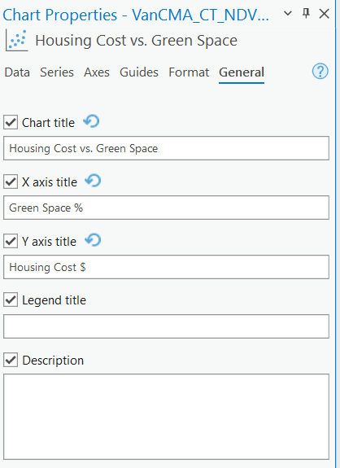

  

    Table of contents
  

  {: .text-delta }
1. TOC
{:toc}

---

# Insert a Layout

Add a layout to your map.  Choose the 8.5":" x 11" Letter size, in the Landscape orientation.  Your task is to create a layout with a **Map** showing Mean NDVI by DA along side a **Chart** showing the relationship between Income and Green Veg Fraction.

# Adding a Chart to the Layout

Arc allows you to add charts to your layout in addition to maps.

  <iframe src="content/videos/Layout.mp4" title="Processes" scrolling="no" frameborder="0"
    style="border: 0;
   height: 100%;
   left: 0;
   position: absolute;
   top: 0;
   width: 100%;">
   
Your browser does not support iframes.

 </iframe>

<a href="content/videos/Layout.mp4" target="_blank">View Image in New Tab</a>

## Change the Chart Title
In the chart properties pane, under general, you can change the title of the chart so it is more concise and fits on the layout better.

## Resize Items and Set Map Scale
Resize the map and chart so the map is a bit bigger than the chart.  Then set the map scale to 1:100,000 and add the scale to the map.

## Add Other Map Elements
Add all the appropriate map elements: Title, Legend, North Arrow, and Source Statement.  You can reference previous Modules for a refresher on how to do this.
* For the Data Source in you Name/Source Statement, list Stats Canada and Google Earth Engine as the data sources
* Your final map should look something like shown below.
  * The chart should show the relationship between green vegetation area and income.  The map should show mean NDVI value by DA.
  * This map is just a rough guide, feel free to make your own stylistic choices to improve on it.  Your values should look a bit different, so don't be concerned if the numbers don't match perfectly!

  <iframe src="content/images/FinalMap.png" title="Processes" scrolling="no" frameborder="0"
    style="border: 0;
   height: 100%;
   left: 0;
   position: absolute;
   top: 0;
   width: 100%;">
   
Your browser does not support iframes.

 </iframe>

<a href="content/images/FinalMap.png" target="_blank">View Image in New Tab</a>

